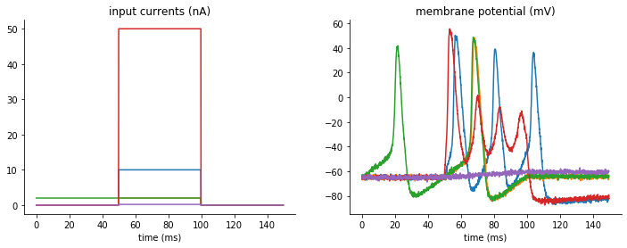

Tutorial: TraceFitter
=====================

In following documentation we will explain how to get started with using :py:class:`~brian2modelfitting.modelfitting.TraceFitter`.
Here we will optimize conductances for Hodgkin-Huxley cell model.

We start by importing brian2 and brian2modelfitting:

.. code:: python

  from brian2 import *
  from brian2modelfitting import *

Problem description
-------------------

We have 2 step input currents of different amplitude and two "data samples" recorded
from the model with goal parameters. The goal of this exercise is to optimize the
conductances of the model ``gl``, ``g_na``, ``g_kd``, for which we know the expected
ranges.

Visualization of input currents and corresponding output traces for which we will
optimize:

Procedure
---------

Model definition
~~~~~~~~~~~~~~~~

We have to specify all of the constants for the model

.. code:: python

  Cm=1*ufarad*cm**-2 * area
  El=-65*mV
  EK=-90*mV
  ENa=50*mV
  VT=-63*mV

Then, we have to define our and model with Equations object, in the following manner:

.. code:: python

  model = Equations(
  '''
  dv/dt = (gl*(El-v) - g_na*(m*m*m)*h*(v-ENa) - g_kd*(n*n*n*n)*(v-EK) + I)/Cm : volt
  dm/dt = 0.32*(mV**-1)*(13.*mV-v+VT)/
    (exp((13.*mV-v+VT)/(4.*mV))-1.)/ms*(1-m)-0.28*(mV**-1)*(v-VT-40.*mV)/
    (exp((v-VT-40.*mV)/(5.*mV))-1.)/ms*m : 1
  dn/dt = 0.032*(mV**-1)*(15.*mV-v+VT)/
    (exp((15.*mV-v+VT)/(5.*mV))-1.)/ms*(1.-n)-.5*exp((10.*mV-v+VT)/(40.*mV))/ms*n : 1
  dh/dt = 0.128*exp((17.*mV-v+VT)/(18.*mV))/ms*(1.-h)-4./(1+exp((40.*mV-v+VT)/(5.*mV)))/ms*h : 1
  g_na : siemens (constant)
  g_kd : siemens (constant)
  gl   : siemens (constant)
  ''',)

.. note::

   You have to identify the parameters you want to optimize, by adding them as constant variables to the equation.

Optimizer and metric
~~~~~~~~~~~~~~~~~~~~

Once we know our model and parameters, it's time to pick an optimizing algorithm
and a metric that will be used as a measure.

For simplicity we will use :py:class:`~brian2modelfitting.optimizer.NevergradOptimizer` default method
(`Differential Evolution`) and Mean Square Error :py:class:`~brian2modelfitting.metric.MSEMetric`:

.. code:: python

  opt = NevergradOptimizer()
  metric = MSEMetric()

Fitter Initiation
~~~~~~~~~~~~~~~~~

Since we are going to optimize over traces produced by the model, we need to initiate the fitter :py:class:`~brian2modelfitting.modelfitting.modelfitting.TraceFitter`:
The minimum set of input parameters for the fitter, includes the ``model`` definition, ``input`` and ``output`` variable names and traces,
time step ``dt``, number of samples we want to draw in each optimization round.

.. code:: python

  fitter = TraceFitter(model=model,
                       input_var='I',
                       output_var='v',
                       input=inp_trace * amp,
                       output=out_trace*mV,
                       dt=0.01*ms,
                       n_samples=10,
                       method='exponential_euler',
                       param_init={'v': -65*mV})

Additionally, in this example, we pick the integration method to be ``'exponential_euler'``,
and we specify the initial value of integrated ``v``, by using the option: ``param_init={'v': -65*mV},``

Fit
~~~

We are now ready to perform the optimization, by calling :py:meth:`~brian2modelfitting.modelfitting.TraceFitter.fit`.
We need to pass the ``optimizer``, ``metric`` and pick a number of rounds (``n_rounds``).

.. note::

  Here you have to also pass the ranges for each of the parameters that was defined as a constant!

.. code:: python

  res, error = fitter.fit(n_rounds=2,
                          optimizer=opt,
                          metric=metric,
                          gl=[2*psiemens, 200*nsiemens],
                          g_na=[200*nsiemens, 0.4*msiemens],
                          g_kd=[200*nsiemens, 200*usiemens])

Output:
 - ``res``: dictionary with best fit values from this optimization
 - ``error``: corresponding error

Default print of this optimization will tell us the best score in each round of optimization and corresponding error:

.. code:: python

  Round 0: fit (4.222867177282197e-05, 7.504100120635022e-08, 4.772988880219001e-05) with error: 0.5165218259614359
  Round 1: fit (2.676589777337801e-05, 1.482336088690629e-07, 0.0001772869243329754) with error: 0.1665320942433037

Generating traces
~~~~~~~~~~~~~~~~~
To generate the traces that correspond to the new best fit parameters of the model, use :py:meth:`~brian2modelfitting.modelfitting.TraceFitter.generate_traces`
method. For which you also have to specify the initial value of ``v``.

.. code:: python

  traces = fitter.generate_traces(param_init={'v': -65*mV})

The following ``fit`` traces in comparison to our goal data:

