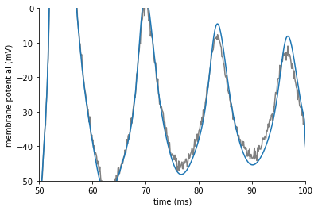
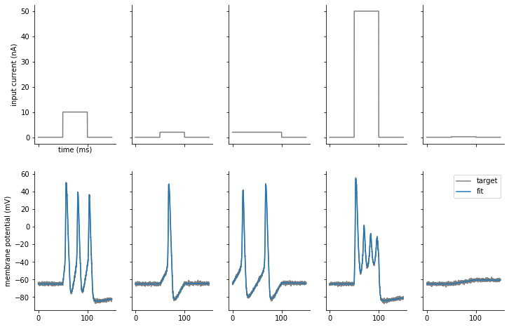
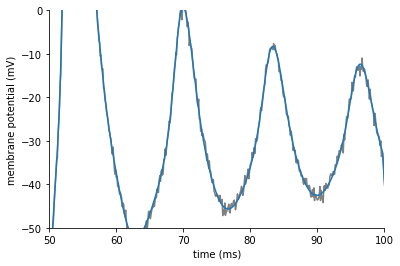

Tutorial: TraceFitter
=====================

In following documentation we will explain how to get started with using
`~brian2modelfitting.fitter.TraceFitter`. Here we will optimize conductances for
a Hodgkin-Huxley cell model.

We start by importing ``brian2`` and ``brian2modelfitting``:

.. code:: python

  from brian2 import *
  from brian2modelfitting import *

Problem description
-------------------
We have five step input currents of different amplitude and five "data samples"
recorded from the model with goal parameters. The goal of this exercise is to
optimize the conductances of the model ``gl``, ``g_na``, ``g_kd``, for which we
know the expected ranges.

Visualization of input currents and corresponding output traces which we will
try to fit:

.. image:: ../_static/hh_tutorial_input.png

We can load these currents and "recorded" membrane potentials with the pandas library

.. code:: python

    import pandas as pd
    inp_trace = pd.read_csv('input_traces_hh.csv', index_col=0).to_numpy()
    out_trace = pd.read_csv('output_traces_hh.csv', index_col=0).to_numpy()

.. note::

    You can download the CSV files used above here:
    :download:`input_traces_hh.csv <../../examples/input_traces_hh.csv>`,
    :download:`output_traces_hh.csv <../../examples/output_traces_hh.csv>`

Procedure
---------

Model definition
~~~~~~~~~~~~~~~~

We have to specify all of the constants for the model

.. code:: python

  area = 20000*umetre**2
  Cm=1*ufarad*cm**-2 * area
  El=-65*mV
  EK=-90*mV
  ENa=50*mV
  VT=-63*mV

Then, we have to define our model:

.. code:: python

  model = '''
  dv/dt = (gl*(El-v) - g_na*(m*m*m)*h*(v-ENa) - g_kd*(n*n*n*n)*(v-EK) + I)/Cm : volt
  dm/dt = 0.32*(mV**-1)*(13.*mV-v+VT)/
    (exp((13.*mV-v+VT)/(4.*mV))-1.)/ms*(1-m)-0.28*(mV**-1)*(v-VT-40.*mV)/
    (exp((v-VT-40.*mV)/(5.*mV))-1.)/ms*m : 1
  dn/dt = 0.032*(mV**-1)*(15.*mV-v+VT)/
    (exp((15.*mV-v+VT)/(5.*mV))-1.)/ms*(1.-n)-.5*exp((10.*mV-v+VT)/(40.*mV))/ms*n : 1
  dh/dt = 0.128*exp((17.*mV-v+VT)/(18.*mV))/ms*(1.-h)-4./(1+exp((40.*mV-v+VT)/(5.*mV)))/ms*h : 1
  g_na : siemens (constant)
  g_kd : siemens (constant)
  gl   : siemens (constant)
  '''

.. note::

   You have to identify the parameters you want to optimize by adding them as
   constant variables to the equation.

Optimizer and metric
~~~~~~~~~~~~~~~~~~~~
Once we know our model and parameters, it's time to pick an optimizing algorithm
and a metric that will be used as a measure.

For simplicity we will use the default method provided by the
`~brian2modelfitting.optimizer.NevergradOptimizer`, i.e.
"Differential Evolution", and the `~brian2modelfitting.metric.MSEMetric`,
calculating the mean squared error between simulated and data traces:

.. code:: python

  opt = NevergradOptimizer()
  metric = MSEMetric()

Fitter Initiation
~~~~~~~~~~~~~~~~~

Since we are going to optimize over traces produced by the model, we need to
initiate the fitter `~brian2modelfitting.fitter.TraceFitter`:
The minimum set of input parameters for the fitter, includes the ``model``
definition, ``input`` and ``output`` variable names and traces,
time step ``dt``, number of samples we want to draw in each optimization round.

.. code:: python

  fitter = TraceFitter(model=model,
                       input_var='I',
                       output_var='v',
                       input=inp_trace * amp,
                       output=out_trace*mV,
                       dt=0.01*ms,
                       n_samples=100,
                       method='exponential_euler',
                       param_init={'v': -65*mV})

Additionally, in this example, we pick the integration method to be
``'exponential_euler'``, and we specify the initial value of the state variable
``v``, by using the option: ``param_init={'v': -65*mV}``.

Fit
~~~
We are now ready to perform the optimization, by calling the
`~brian2modelfitting.fitter.TraceFitter.fit` method. We need to pass the
``optimizer``, ``metric`` and pick a number of rounds(``n_rounds``).

.. note::

  Here you have to also pass the ranges for each of the parameters that was defined as a constant!

.. code:: python

  res, error = fitter.fit(n_rounds=10,
                          optimizer=opt,
                          metric=metric,
                          gl=[2*psiemens, 200*nsiemens],
                          g_na=[200*nsiemens, 0.4*msiemens],
                          g_kd=[200*nsiemens, 200*usiemens])

Output:
 - ``res``: dictionary with best fit values from this optimization
 - ``error``: corresponding error

The default output during the optimization run will tell us the best parameters
in each round of optimization and the corresponding error:

.. code:: pycon

    Round 0: fit [9.850944960633812e-05, 5.136956717618642e-05, 1.132001753695881e-07] with error: 0.00023112503428419085
    Round 1: fit [2.5885625978001192e-05, 5.994175009416155e-05, 1.132001753695881e-07] with error: 0.0001351283127819249
    Round 2: fit [2.358033085911261e-05, 5.2863196016834924e-05, 7.255743458079185e-08] with error: 8.600916130059129e-05
    Round 3: fit [2.013515980650059e-05, 4.5888592959196316e-05, 7.3254174819061e-08] with error: 5.704891495098806e-05
    Round 4: fit [9.666300621928093e-06, 3.471303670631636e-05, 2.6927249265934296e-08] with error: 3.237910401003197e-05
    Round 5: fit [8.037164838105382e-06, 2.155149445338687e-05, 1.9305129338706338e-08] with error: 1.080794896277778e-05
    Round 6: fit [7.161113899555702e-06, 2.2680883630214104e-05, 2.369859751788268e-08] with error: 4.527456021770018e-06
    Round 7: fit [7.471475084450997e-06, 2.3920164839406964e-05, 1.7956856689140395e-08] with error: 4.4765688852930405e-06
    Round 8: fit [6.511156620775884e-06, 2.209792671051356e-05, 1.368667359118384e-08] with error: 1.8105782339584402e-06
    Round 9: fit [6.511156620775884e-06, 2.209792671051356e-05, 1.368667359118384e-08] with error: 1.8105782339584402e-06

Generating traces
~~~~~~~~~~~~~~~~~
To generate the traces that correspond to the new best fit parameters of the
model, you can use the `~brian2modelfitting.fitter.TraceFitter.generate_traces`
method.

.. code:: python

  traces = fitter.generate_traces()

The following plot shows the fit traces in comparison to our target data:

.. image:: ../_static/hh_best_fit.png

The fit looks good in general, but if we zoom in on the fourth column we see that the
fit is still not perfect:

We can improve the fit by using a classic, sequential curve fitting algorithm.

Refining fits
~~~~~~~~~~~~~
When using `~brian2modelfitting.fitter.TraceFitter`, you can further refine the fit by
applying a standard least squares fitting algorithm (e.g. Levenberg–Marquardt), by calling
`~brian2modelfitting.fitter.TraceFitter.refine`. By default, this will start from the
previously found best parameters:

.. code:: python

    refined_params, result_info = fitter.refine()

We can now generate traces with the refined parameters:

.. code:: python

    traces = fitter.generate_traces(params=refined_params)

Plotting the results, we see that the fits have improved and now closely match the
target data:

