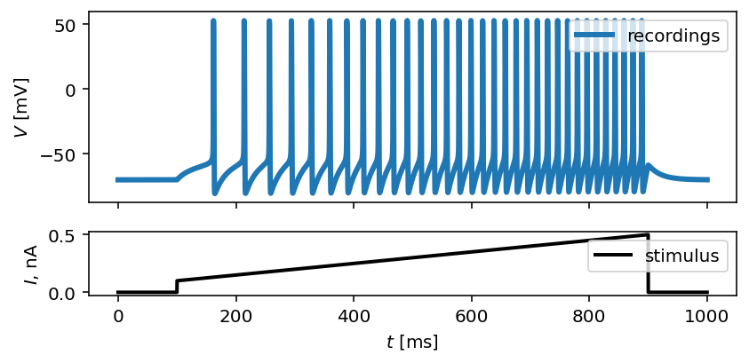
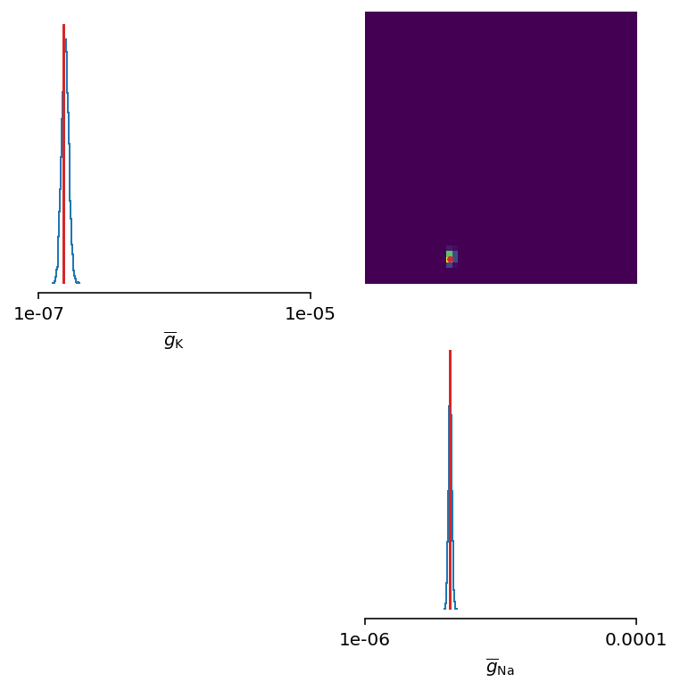
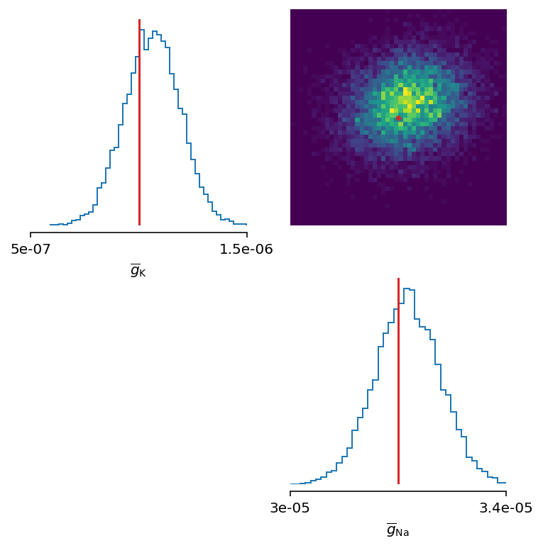
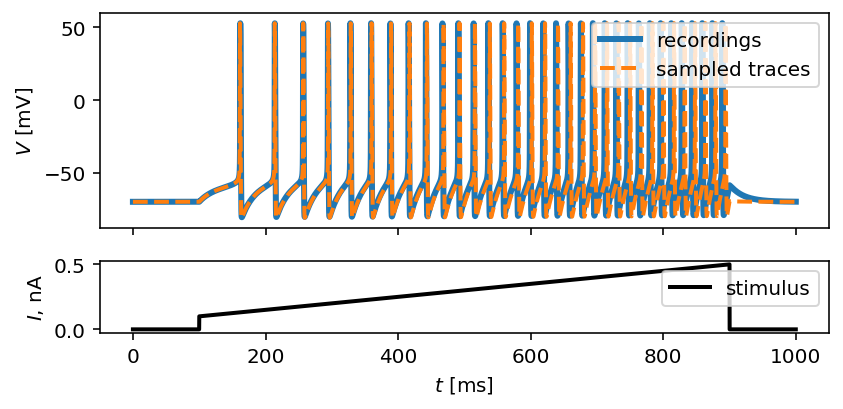
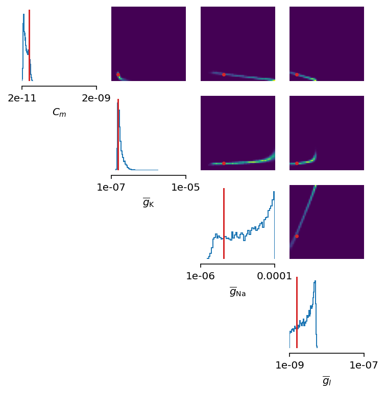
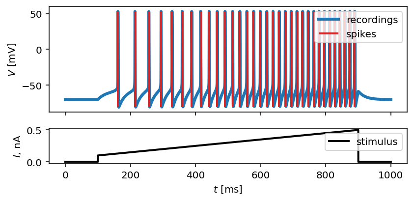
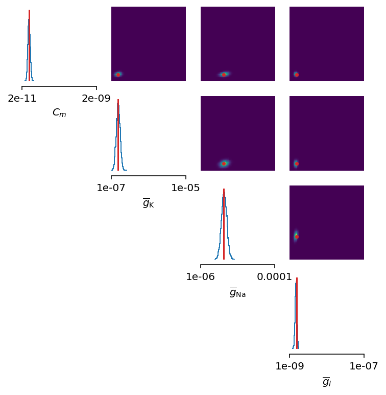
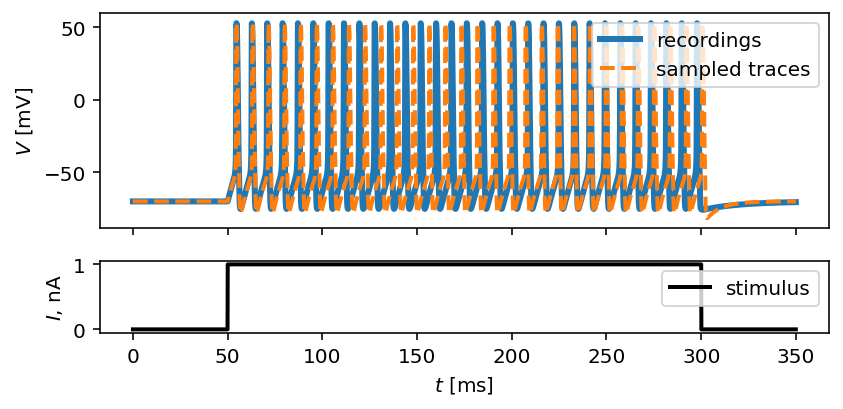
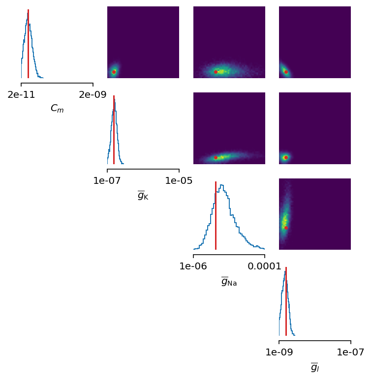

Tutorial: Inferencer
====================

In this tutorial, we use simulation-based inference on the Hodgkin-Huxley
neuron model, where different scenarios are considered. The data are
synthetically generated from the model which enables the comparisson of the
optimized parameter values with the ground truth parameter values as used in
the generative model.

We start with importing basic packages and modules. Note that
``tutorial_sbi_helpers`` contains three different functions that are used
extensively throughout this tutorial. Namely, ``plot_traces`` is used for
visualization of the input current and output voltage traces, and optionally
for visualization of spike trains or sampled traces obtained by using an
estimated posterior. In order to detect and capture spike events in a given
voltage trace, we use ``spike_times`` function. Finally,
``plot_cond_coeff_mat`` is used to visualize conditional coerrelation matrix.
For a detailed overview of the mechanism of each of the functions, download
the script: :download:`tutorial_sbi_helpers.py <../../examples/tutorial_sbi_helpers.py>`

.. code:: python

    from brian2 import *
    from brian2modelfitting import Inferencer
    from scipy.stats import kurtosis as kurt
    from tutorial_sbi_helpers import (spike_times,
                                      plot_traces,
                                      plot_cond_coeff_mat)

Now, let's load the input current and output voltage traces by using ``NumPy``.
Note that all functions available in ``NumPy``, as well as in ``Matplotlib``,
are implicitly available after ``brian2``  was imported.

.. code:: python

    inp_traces = load('input_traces_synthetic.npy').reshape(1, -1)
    out_traces = load('output_traces_synthetic.npy').reshape(1, -1)

The data is generated by running ``generate_traces_synthetic.py`` script:
:download:`generate_traces_synthetic.py <../../examples/generate_traces_synthetic.py>`

By setting the time step, we are able to set up the time domain. From the
array of time steps, we also define the exact time when the stimulus starts
and when it ends by computing ``stim_start`` and ``stim_end``, respectively.
This will come handy later during the feature extraction process.

.. code:: python

    dt = 0.05*ms
    t = arange(0, inp_traces.size*dt/ms, dt/ms)
    stim_start, stim_end = t[where(inp_traces[0, :] != 0)[0][[0, -1]]]

By calling ``plot_traces`` and passing the array of time steps, the input
current and output voltage traces, we obtain the visualization of a synthetic
neural activity recordings:

.. code:: python

    fig, ax = plot_traces(t, inp_traces, out_traces)

Toy-example: infer two free parameters
--------------------------------------

The first scenario we cover is a simple inference procedure of two unknown
parameters in the Hodgkin-Huxley neuron model. The parameters to infer are
the maximal value of sodium, :math:`\overline{g}_\mathrm{Na}`, and potassium
electrical conductances, :math:`\overline{g}_\mathrm{K}`.

By following the standard practice from Brian 2 simulator, we have to define
parameters of the model, initial conditions for differential equations that
describe the model, and the model itself:

.. code:: python

    # set parameters of the model
    E_Na = 53*mV
    E_K = -107*mV
    E_l = -70*mV
    VT = -60.0*mV
    g_l = 10*nS
    Cm = 200*pF

    # set ground truth parameters, which are unknown from the model's perspective
    ground_truth_params = {'g_Na': 32*uS,
                           'g_K': 1*uS}

    # define initial conditions
    init_conds = {'v': 'E_l',
                  'm': '1 / (1 + beta_m / alpha_m)',
                  'h': '1 / (1 + beta_h / alpha_h)',
                  'n': '1 / (1 + beta_n / alpha_n)'}

    # define the Hodgkin-Huxley neuron model
    eqs = '''
        # non-linear set of ordinary differential equations
        dv/dt = - (g_Na * m ** 3 * h * (v - E_Na)
                   + g_K * n ** 4 * (v - E_K)
                   + g_l * (v - E_l) - I) / Cm : volt
        dm/dt = alpha_m * (1 - m) - beta_m * m : 1
        dn/dt = alpha_n * (1 - n) - beta_n * n : 1
        dh/dt = alpha_h * (1 - h) - beta_h * h : 1
        
        # time independent rate constants for a channel activation/inactivation
        alpha_m = ((-0.32 / mV) * (v - VT - 13.*mV))
                   / (exp((-(v - VT - 13.*mV)) / (4.*mV)) - 1) / ms : Hz
        beta_m = ((0.28/mV) * (v - VT - 40.*mV))
                  / (exp((v - VT - 40.*mV) / (5.*mV)) - 1) / ms : Hz
        alpha_h = 0.128 * exp(-(v - VT - 17.*mV) / (18.*mV)) / ms : Hz
        beta_h = 4 / (1 + exp((-(v - VT - 40.*mV)) / (5.*mV))) / ms : Hz
        alpha_n = ((-0.032/mV) * (v - VT - 15.*mV))
                   / (exp((-(v - VT - 15.*mV)) / (5.*mV)) - 1) / ms : Hz
        beta_n = 0.5 * exp(-(v - VT - 10.*mV) / (40.*mV)) / ms : Hz
            
        # free parameters
        g_Na : siemens (constant)
        g_K : siemens (constant)
        '''

Since the output of the model is extremely high-dimensional, and since we are
interested only in a few hand-picked features that will capture the gist of
the neuronal activity, we start the inference process by defining a list of
summary functions.

Each summary feature is obtained by calling a single-valued function on each
trace generated by using a sampled prior distribution over unknown parameters.
In this case, we consider the maximal value, mean and standard deviatian of
action potential, and the membrane resting potential.

.. code:: python

    v_features = [
        # max action potential
        lambda x: np.max(x[(t > stim_start) & (t < stim_end)]),
        # mean action potential
        lambda x: np.mean(x[(t > stim_start) & (t < stim_end)]),
        # std of action potential
        lambda x: np.std(x[(t > stim_start) & (t < stim_end)]),
        # membrane resting potential
        lambda x: np.mean(x[(t > 0.1 * stim_start) & (t < 0.9 * stim_start)])
    ]

Inferencer
~~~~~~~~~~

The minimum set of arguments for the `~brian2modelfitting.inferencer.Inferencer`
class constructor are the time step, ``dt``, input data traces, ``input``,
output data traces, ``output``, and the model that will be used for the
inference process, ``model``. Input and output traces should have the number
of rows that corresponds to the number of observed traces, and the number of
columns should be equal to the number of time steps in each trace. 

Here, we define additional arguments such as: ``method`` to define an
integration technique used for solving the set of differential equations,
``threshold`` to define a condition that produce a single spike, ``refractory``
to define a condition under which a neuron remains refractory, and
``param_init`` to define a set of initial conditions. We also define the set of
summary features that is used to represent the data instead of using the entire
trace. Summary features are passed to the inference algorithm via ``features``
argument.

.. code:: python

    inferencer = Inferencer(dt=dt, model=eqs,
                            input={'I': inp_traces*amp},
                            output={'v': out_traces*mV},
                            features={'v': v_features},
                            method='exponential_euler',
                            threshold='m > 0.5',
                            refractory='m > 0.5',
                            param_init=init_conds)

After the ``inferencer`` is instantiated, we may begin the inference process
by calling `~brian2modelfitting.inferencer.Inferencer.infer` and defining the
total number of samples that are used for the training of a neural density
estimator.

Posterior
~~~~~~~~~

Neural density estimator learns the probabilistic mapping of the input data,
i.e., sampled parameter values given a prior distribution, and the output data,
i.e., summary features extracted from the traces, obtained by solving the model
with the corresponding set of sampled parameters from the input data.

We can choose the inference method and the estimator model , but only
arguments that `~brian2modelfitting.inferencer.Inferencer.infer` requires are
the number of samples (in case of running the inference process for the first
time), ``n_samples``, and upper and lower bounds for each unknown parameter.

.. code:: python

    posterior = inferencer.infer(n_samples=15_000,
                                 n_rounds=1,
                                 inference_method='SNPE',
                                 density_estimator_model='maf',
                                 g_Na=[1*uS, 100*uS],
                                 g_K=[0.1*uS, 10*uS])

After inference is completed, the estimated posterior distribution can be
analyzed by observing the pairwise relationship between each pair of
parameters. But before, we have to draw samples from the estimated posterior
as follows:

.. code:: python

    samples = inferencer.sample((10_000, ))

The samples are stored inside the `~brian2modelfitting.inferencer.Inferencer`
object and are available through ``samples`` variable.
We create a visual representation of the pairwise relationship of the posterior
as follows:

.. code:: python

    limits = {'g_Na': [1*uS, 100*uS],
              'g_K': [0.1*uS, 10*uS]}
    labels = {'g_Na': r'$\overline{g}_{Na}$',
              'g_K': r'$\overline{g}_{K}$'}
    fig, ax = inferencer.pairplot(limits=limits,
                                  labels=labels,
                                  ticks=limits,
                                  points=ground_truth_params,
                                  points_offdiag={'markersize': 5},
                                  points_colors=['C3'],
                                  figsize=(6, 6))

Let's zoom in a bit:

The inferred posterior is plotted against the ground truth parameters, and as
can be seen, the ground truth parameters are located in high-probability
regions of the estimated distribution.

To further substantiate this, let's now see the traces simulated from a single
set of parameters sampled from the posterior:

.. code:: python

    inf_traces = inferencer.generate_traces()

We again use the ``plot_traces`` function as follows:

.. code:: python

    fig, ax = plot_traces(t, inp_traces, out_traces, inf_traces=array(inf_traces/mV))

Additional free parameters
--------------------------

The simple scenarios where only 2 parameters are considered works quite well
using synthetic data traces. What if we have a larger number of unkown
parameters? Let's now consider additional unkown parameters for the same model
as before. In addition to the unknown maximal values of the
electrical conductance of the sodium and potassium channels, the membrane
capacity, :math:`C_m`, and the maximal value of the electrical conductance of
the leakage ion channel, :math:`\overline{g}_{l}`, are also unknown.

We can try to do the same as before with a bit more training data:

.. code:: python
    
    del Cm, g_l

    # set parameters, initial condition and the model
    E_Na = 53*mV
    E_K = -107*mV
    E_l = -70*mV
    VT = -60.0*mV

    ground_truth_params = {'g_Na': 32*uS,
                           'g_K': 1*uS,
                           'g_l': 10*nS,
                           'Cm': 200*pF}

    init_conds = {'v': 'E_l',
                  'm': '1 / (1 + beta_m / alpha_m)',
                  'h': '1 / (1 + beta_h / alpha_h)',
                  'n': '1 / (1 + beta_n / alpha_n)'}

    eqs = '''
        # non-linear set of ordinary differential equations
        dv/dt = - (g_Na * m ** 3 * h * (v - E_Na)
                   + g_K * n ** 4 * (v - E_K)
                   + g_l * (v - E_l) - I) / Cm : volt
        dm/dt = alpha_m * (1 - m) - beta_m * m : 1
        dn/dt = alpha_n * (1 - n) - beta_n * n : 1
        dh/dt = alpha_h * (1 - h) - beta_h * h : 1
        
        # time independent rate constants for activation and inactivation
        alpha_m = ((-0.32 / mV) * (v - VT - 13.*mV))
                   / (exp((-(v - VT - 13.*mV)) / (4.*mV)) - 1) / ms : Hz
        beta_m = ((0.28/mV) * (v - VT - 40.*mV))
                  / (exp((v - VT - 40.*mV) / (5.*mV)) - 1) / ms : Hz
        alpha_h = 0.128 * exp(-(v - VT - 17.*mV) / (18.*mV)) / ms : Hz
        beta_h = 4 / (1 + exp((-(v - VT - 40.*mV)) / (5.*mV))) / ms : Hz
        alpha_n = ((-0.032/mV) * (v - VT - 15.*mV))
                   / (exp((-(v - VT - 15.*mV)) / (5.*mV)) - 1) / ms : Hz
        beta_n = 0.5 * exp(-(v - VT - 10.*mV) / (40.*mV)) / ms : Hz
            
        # free parameters
        g_Na : siemens (constant)
        g_K : siemens (constant)
        g_l : siemens (constant)
        Cm : farad (constant)
        '''

    # infer the posterior using the same configuration as before
    inferencer = Inferencer(dt=dt, model=eqs,
                            input={'I': inp_traces*amp},
                            output={'v': out_traces*mV},
                            features={'v': v_features},
                            method='exponential_euler',
                            threshold='m > 0.5',
                            refractory='m > 0.5',
                            param_init=init_conds)

    posterior = inferencer.infer(n_samples=20_000,
                                 n_rounds=1,
                                 inference_method='SNPE',
                                 density_estimator_model='maf',
                                 g_Na=[1*uS, 100*uS],
                                 g_K=[0.1*uS, 10*uS],
                                 g_l=[1*nS, 100*nS],
                                 Cm=[20*pF, 2*nF])

    # finally, sample and visualize the posterior distribution
    samples = inferencer.sample((10_000, ))

    limits = {'g_Na': [1*uS, 100*uS],
              'g_K': [0.1*uS, 10*uS],
              'g_l': [1*nS, 100*nS],
              'Cm': [20*pF, 2*nF]}
    labels = {'g_Na': r'$\overline{g}_{Na}$',
              'g_K': r'$\overline{g}_{K}$',
              'g_l': r'$\overline{g}_{l}$',
              'Cm': r'$C_{m}$'}
    fig, ax = inferencer.pairplot(limits=limits,
                                  labels=labels,
                                  ticks=limits,
                                  points=ground_truth_params,
                                  points_offdiag={'markersize': 5},
                                  points_colors=['C3'],
                                  figsize=(6, 6))

.. image:: ../_static/hh_sbi_4params_4features_pairplot.png
    :width: 70 %

This could have been expected. The posterior distribution is estimated poorly
using a simple approach as in the toy example.

Yes, we can play around with hyper-parameters and tuning the neural density
estimator, but with this apporach we will not get far.

We can, however, try with the non-amortized (or focused) approach, meaning we
perform multi-round inference, where each following round will use the
posterior from the previous one to sample new input data for the training,
rather than using the same prior distribution as defined in the beginning.
This approach yields additional advantage - the number of samples may be
considerably lower, but it will lead to the posterior that is no longer being
amortized - it is accurate only for a specific observation.

.. code:: python

    # note that the only difference is the number of rounds of inference
    posterior = inferencer.infer(n_samples=10_000,
                                 n_rounds=2,
                                 inference_method='SNPE',
                                 density_estimator_model='maf',
                                 restart=True,
                                 g_Na=[1*uS, 100*uS],
                                 g_K=[0.1*uS, 10*uS],
                                 g_l=[1*nS, 100*nS],
                                 Cm=[20*pF, 2*nF])

    samples = inferencer.sample((10_000, ))

    fig, ax = inferencer.pairplot(limits=limits,
                                  labels=labels,
                                  ticks=limits,
                                  points=ground_truth_params,
                                  points_offdiag={'markersize': 5},
                                  points_colors=['C3'],
                                  figsize=(6, 6))
                        

This seems as a promising approach for parameters that already have the
high-probability regions of the posterior distribution around ground-truth
values. For other parameters, this leads to further deterioration of posterior
estimates.

So, we may wonder, how else can we improve the neural density estimator
accuracy?

Currently, we use only four features to describe extremely complex output of a
neural model and should probably create a more comprehensive and more
descriptive set of summary features. If we want to include data related to
spikes in summary statistics, it is necessary to perform multi-objective
optimization since we will observe spike trains as an output in addition to
voltage traces.

Multi-objective optimization
~~~~~~~~~~~~~~~~~~~~~~~~~~~~

In order to use spikes, we have to have some observation to pass to the
`~brian2modelfitting.inferencer.Inferencer`. We can utilize ``spike_times`` as
follows:

.. code:: python

    spike_times_list = [spike_times(t, out_trace) for out_trace in out_traces]

To visually prove that spike times are indeed correct, we use ``plot_traces``:

.. code:: python

    fig, ax = plot_traces(t, inp_traces, out_traces, spike_times_list[0])

Now, let's create additional features that will be applied to voltage traces,
and a few features that will be applied to spike trains:

.. code:: python

    def voltage_deflection(x):
        voltage_base = np.mean(x[t < stim_start])
        stim_end_idx = np.where(t >= stim_end)[0][0]
        steady_state_voltage_stimend = np.mean(x[stim_end_idx-10:stim_end_idx-5])
        return steady_state_voltage_stimend - voltage_base

    v_features = [
        # max action potential
        lambda x: np.max(x[(t > stim_start) & (t < stim_end)]),
        # mean action potential
        lambda x: np.mean(x[(t > stim_start) & (t < stim_end)]),
        # std of action potential
        lambda x: np.std(x[(t > stim_start) & (t < stim_end)]),
        # kurtosis of action potential
        lambda x: kurt(x[(t > stim_start) & (t < stim_end)], fisher=False),
        # membrane resting potential
        lambda x: np.mean(x[(t > 0.1 * stim_start) & (t < 0.9 * stim_start)]),
        # the voltage deflection between base and steady-state voltage
        voltage_deflection,
    ]

    s_features = [
        # number of spikes in a train
        lambda x: x.size,
        # mean inter-spike interval
        lambda x: 0. if np.diff(x).size == 0 else np.mean(diff(x)),
        # time to first spike
        lambda x: 0. if x.size == 0 else x[0]
    ]

The rest of the inference process stays pretty much the same as before:

.. code:: python

    inferencer = Inferencer(dt=dt, model=eqs,
                            input={'I': inp_traces*amp},
                            output={'v': out_traces*mV, 'spikes': spike_times_list},
                            features={'v': v_features, 'spikes': s_features},
                            method='exponential_euler',
                            threshold='m > 0.5',
                            refractory='m > 0.5',
                            param_init=init_conds)

    posterior = inferencer.infer(n_samples=20_000,
                                 n_rounds=1,
                                 inference_method='SNPE',
                                 density_estimator_model='maf',
                                 g_Na=[1*uS, 100*uS],
                                 g_K=[0.1*uS, 10*uS],
                                 g_l=[1*nS, 100*nS],
                                 Cm=[20*pF, 2*nF])

    samples = inferencer.sample((10_000, ))

    fig, ax = inferencer.pairplot(limits=limits,
                                  labels=labels,
                                  ticks=limits,
                                  points=ground_truth_params,
                                  points_offdiag={'markersize': 5},
                                  points_colors=['C3'],
                                  figsize=(6, 6))

Let's also visualize the sampled trace, this time using the mean of ten
thousands drawn samples:

.. code:: python

    inf_traces = inferencer.generate_traces(n_samples=10_000, output_var='v')

    fig, ax = plot_traces(t, inp_traces, out_traces, inf_traces=array(inf_traces/mV))

Okay, now we are clearly getting somewhere and this should be a strong
indicatior of the importance of crafting quality summary statistics.

Still, the summary statistics can be a huge bottleneck and can set back the
training of a neural density estimator. For this reason automatic feature
extraction can be considered instead.

Automatic feature extraction
~~~~~~~~~~~~~~~~~~~~~~~~~~~~

To enable automatic feature extraction, ``features`` argument simly should
not be defined when instantiating an inferencer object. And that's it.
Everything else happens behind the scenes without any need for additional user
intervention. If the user wants to gain additional control over the extraction
process, in addition to changing the hyperparameters, they can also define
their own embedding neural network.

Default settings
################

.. code:: python

    inferencer = Inferencer(dt=dt, model=eqs,
                            input={'I': inp_traces*amp},
                            output={'v': out_traces*mV},
                            method='exponential_euler',
                            threshold='m > 0.5',
                            refractory='m > 0.5',
                            param_init=init_conds)

    posterior = inferencer.infer(n_samples=20_000,
                                 n_rounds=1,
                                 inference_method='SNPE',
                                 density_estimator_model='maf',
                                 g_Na=[1*uS, 100*uS],
                                 g_K=[0.1*uS, 10*uS],
                                 g_l=[1*nS, 100*nS],
                                 Cm=[20*pF, 2*nF])

    samples = inferencer.sample((10_000, ))

    fig, ax = inferencer.pairplot(limits=limits,
                                  labels=labels,
                                  ticks=limits,
                                  points=ground_truth_params,
                                  points_offdiag={'markersize': 5},
                                  points_colors=['C3'],
                                  figsize=(6, 6))

Custom embedding network
########################

Here, we demonstrate how to build a custom summary feature extractor and how
to exploit the GPU processing power to speed up the inference process.

Note that the use of the GPU will result in the speed-up of computation time
only if a custom automatic feature extractor uses techniques that are actually
faster to compute on the GPU.

For this case, we use the YuleNet, a convolutional neural network, proposed in
the paper by Rodrigues and Gramfort 2020, titled *Learning summary features of
time series for likelihood free inference*, preprint available at: https://arxiv.org/abs/2012.02807.
The authors outline impresive results where the automatic feature extraction by
using the YuleNet is capable of outperforming carefully hand-crafted features.

.. code:: python

    import torch
    from torch import nn

    class YuleNet(nn.Module):
        """The summary feature extractor proposed in Rodrigues 2020.
        
        Parameters
        ----------
        in_features : int
            Number of input features should correspond to the size of a
            single output voltage trace.
        out_features : int
            Number of the features that are used for the inference process.
            
        Returns
        -------
        None
        
        References
        ----------
        * Rodrigues, P. L. C. and Gramfort, A. "Learning summary features
          of time series for likelihood free inference" 3rd Workshop on
          Machine Learning and the Physical Sciences (NeurIPS 2020). 2020.
        """
        def __init__(self, in_features, out_features):
            super().__init__()
            self.conv1 = nn.Conv1d(in_channels=1, out_channels=8, kernel_size=64,
                                   stride=1, padding=32, bias=True)
            self.relu1 = nn.ReLU()
            pooling1 = 16
            self.pool1 = nn.AvgPool1d(kernel_size=pooling1)

            self.conv2 = nn.Conv1d(in_channels=8, out_channels=8, kernel_size=64,
                                   stride=1, padding=32, bias=True)
            self.relu2 = nn.ReLU()
            pooling2 = int((in_features // pooling1) // 16)
            self.pool2 = nn.AvgPool1d(kernel_size=pooling2)

            self.dropout = nn.Dropout(p=0.50)
            linear_in = 8 * in_features // (pooling1 * pooling2) - 1
            self.linear = nn.Linear(in_features=linear_in,
                                    out_features=out_features)
            self.relu3 = nn.ReLU()

        def forward(self, x):
            if x.ndim == 1:
                x = x.view(1, 1, -1)
            else:
                x = x.view(len(x), 1, -1)
            x_conv1 = self.conv1(x)
            x_relu1 = self.relu1(x_conv1)
            x_pool1 = self.pool1(x_relu1)

            x_conv2 = self.conv2(x_pool1)
            x_relu2 = self.relu2(x_conv2)
            x_pool2 = self.pool2(x_relu2)
            
            x_flatten = x_pool2.view(len(x), 1, -1)
            x_dropout = self.dropout(x_flatten)

            x = self.relu3(self.linear(x_dropout))
            return x.view(len(x), -1)

In the following code, we also demonstrate how to control the hyperparameters
of the density estimator by using additional keyword arguments in `~brian2modelfitting.inferencer.Inferencer.infer`
method:

.. code:: python

    in_features = out_traces.shape[1]
    out_features = 10

    inferencer = Inferencer(dt=dt, model=eqs,
                            input={'I': inp_traces*amp},
                            output={'v': out_traces*mV},
                            method='exponential_euler',
                            threshold='m > 0.5',
                            refractory='m > 0.5',
                            param_init=init_conds)

    posterior = inferencer.infer(n_samples=20_000,
                                 n_rounds=1,
                                 inference_method='SNPE',
                                 density_estimator_model='maf',
                                 inference_kwargs={'embedding_net': YuleNet(in_features, out_features)},
                                 train_kwargs={'num_atoms': 10,
                                              'training_batch_size': 100,
                                              'use_combined_loss': True,
                                              'discard_prior_samples': True},
                                 sbi_device='gpu',
                                 g_Na=[1*uS, 100*uS],
                                 g_K=[0.1*uS, 10*uS],
                                 g_l=[1*nS, 100*nS],
                                 Cm=[20*pF, 2*nF])

    samples = inferencer.sample((10_000, ))

    fig, ax = inferencer.pairplot(limits=limits,
                                  labels=labels,
                                  ticks=limits,
                                  points=ground_truth_params,
                                  points_offdiag={'markersize': 5},
                                  points_colors=['C3'],
                                  figsize=(6, 6))

Next steps
----------

To learn more read the reference API and check out more examples available
:doc:`here <../examples/index>`.